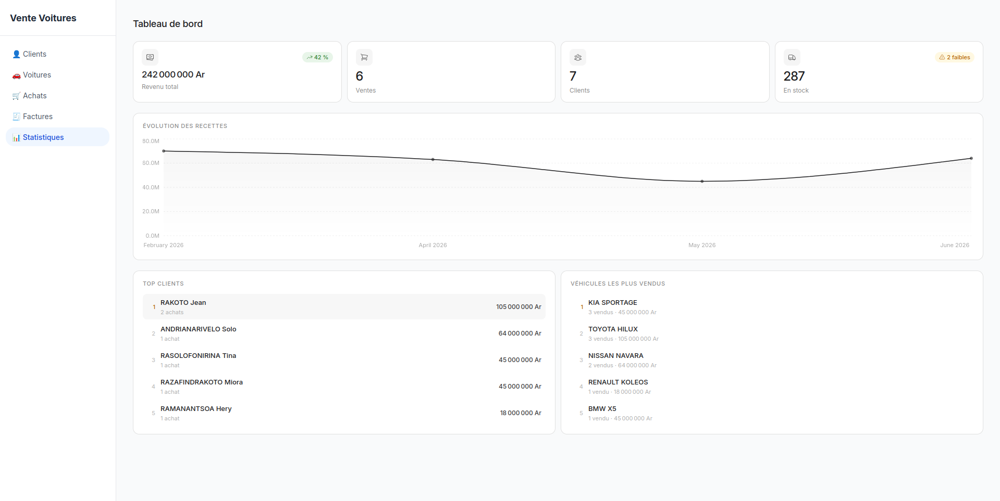
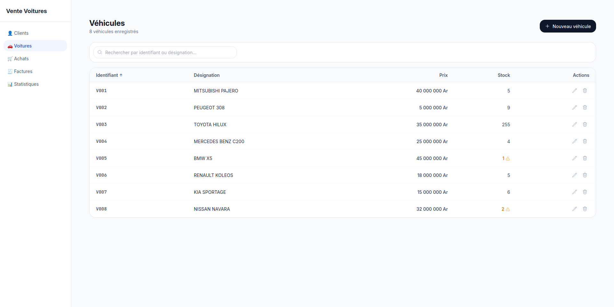
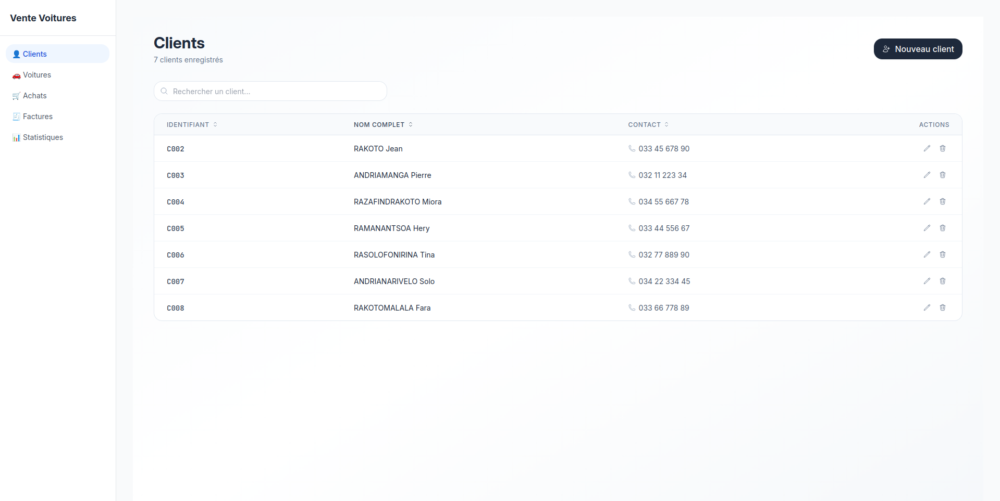
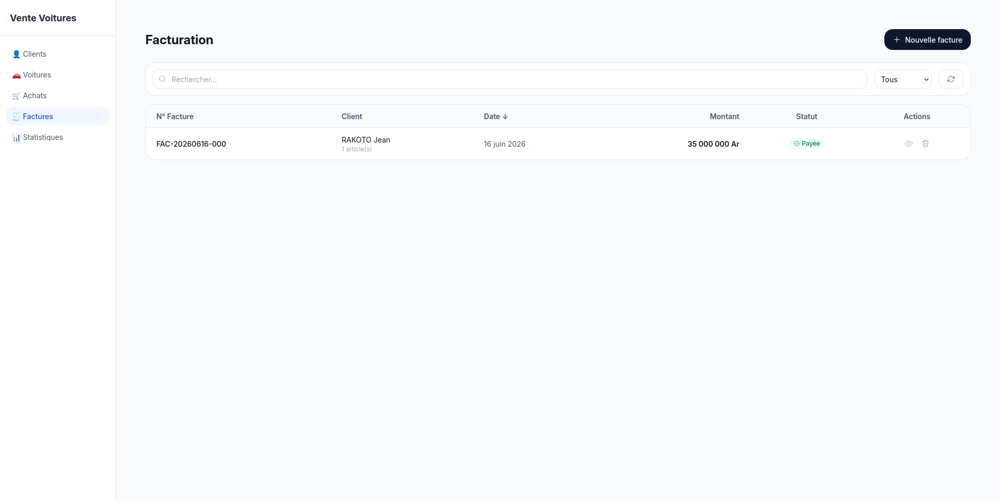
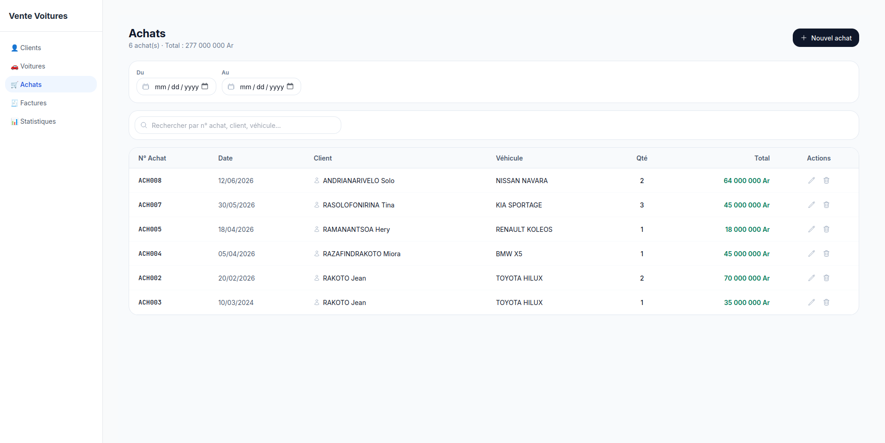

# AutoGest

Application web de gestion de vente de véhicules.

## Fonctionnalités

* Gestion des clients
* Gestion du stock de véhicules
* Enregistrement des achats
* Tableau de bord statistique
* Génération de factures
* Recherche et filtrage des données

## Technologies

* React + Vite
* Tailwind CSS
* Recharts
* PHP (API REST)
* PostgreSQL

## Installation

### Backend

```bash
# Configurer votre serveur web
# Importer le schéma SQL fourni
```

### Frontend

```bash
npm install
npm run dev
```

## Aperçu

### Tableau de bord



### Gestion des véhicules



### Gestion des clients



### Facturation


### Achat


## Auteur 
Jean Joseph 🇲🇬

Projet réalisé dans le cadre d'un apprentissage du développement web full-stack.

